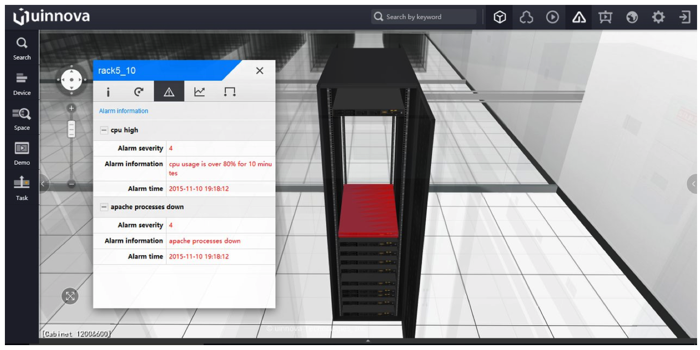
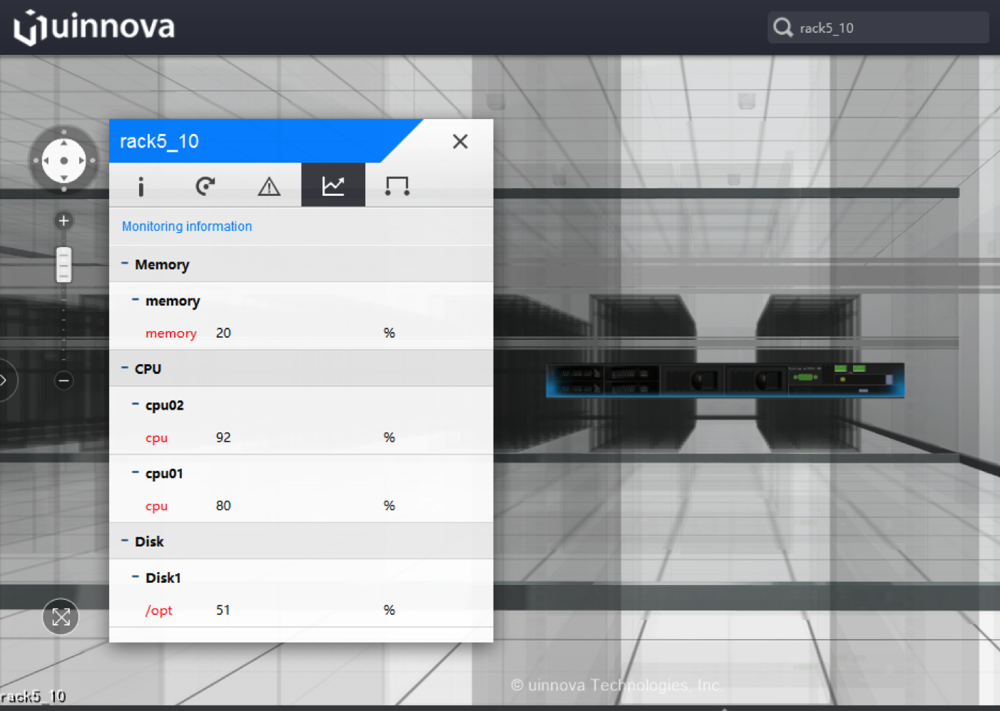
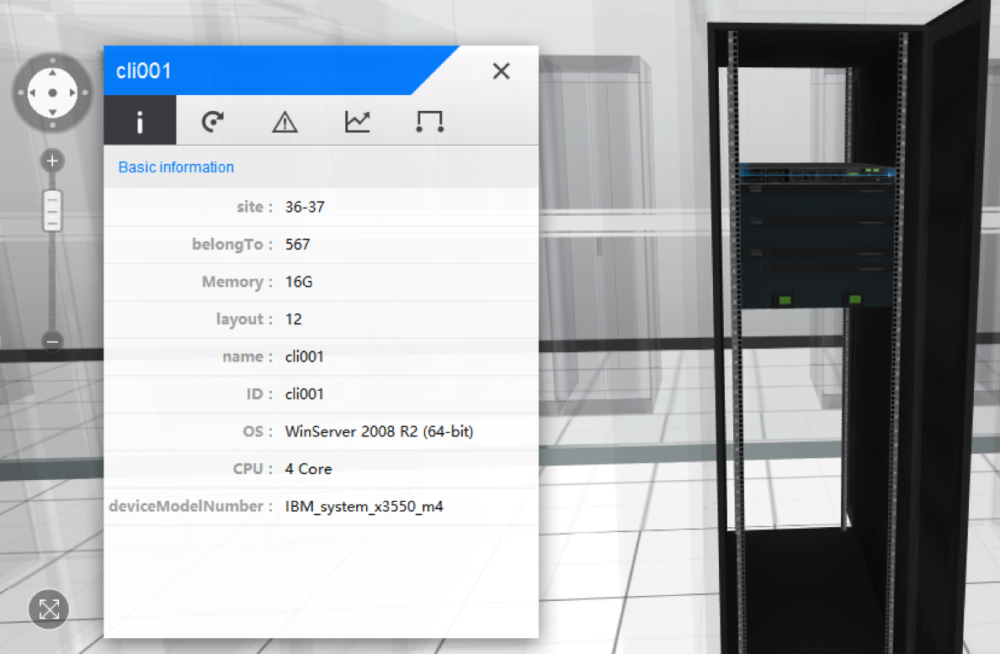

.. _api-cmd-label:

Command Line API
------------------

Summary
^^^^^^^^^^^

uDCV come with a handy command line tools named uDCV-cli, which capable of send alarms, performance data, even add/update/delete asset records by a single command. This howto guide shows you how to use this powerful tool.

Install 
^^^^^^^^^

* download uDCV-cli from uinnova website and unzip the tarball to uDCV server  https://www.dropbox.com/s/45w7h9as09vf4gg/uDCV_cli.zip?dl=0

* that is it !

Send Alarm
^^^^^^^^^^^^^^

**Usage**

Open a windows command line, run ``event.bat``  with follow arguments:

.. csv-table:: **Usage**
    :header: Arguments, Value
    :widths: 40,60
 
    arg1,Scene name    
    arg2,_ 
    arg3,Device ID 
    arg4,Event Title 
    arg5,OPEN/CLOSED 
    arg6,Severity (1 ~6) 1 = highest 
    arg7,Event Body 
    arg8,Occurrence 
    arg9,Modify time 
    arg10,_ 
    arg11,_ 

**Example**

``event.bat ecc _ rack5_10 "cpu high" OPEN 4 "cpu usage is over 80% for 10 minutes" 1447211892000 1447211892000 _ _``
``event.bat ecc _ rack18_11 "apache processes down" OPEN 2 "apache processes down" 1447211892000 1447211892000 _ _``

**Screen Capture**

Send Performance Data
^^^^^^^^^^^^^^^^^^^^^^^

**Usage**

.. csv-table:: **Usage**
    :header: Arguments, Value
    :widths: 40,60

    arg1,Scene name 
    arg2,_ 
    arg3,Device ID 
    arg4,Index group 
    arg5,instance 
    arg6,Index name 
    arg7,[numerical|state] 
    arg8,unit 
    arg9,value 
    arg10,Occurrence 

**Example**

``perf.bat ecc _ rack5_10 CPU cpu01 cpu numerical % 80 1447211892000``

``perf.bat ecc _ rack5_10 Memory memory memory numerical % 20 1447211892000``

``perf.bat ecc _ rack5_10 Disk Disk1 /opt numerical % 51 1447211892000``

**Screen Capture**

Add Asset to Cabinet
^^^^^^^^^^^^^^^^^^^^^

.. csv-table:: **Usage**
    :header: Arguments, Value
    :widths: 40,60
 
    arg1, "Add, update or delete [add| upd| del]"
    arg2,scene   
    arg3,classID such as ``rackDevice``
    arg4,Asset ID    
    arg5, "Asset properties in JSON format, see example below" 

**Example**

.. code-block:: bash

    asset.bat upd ecc rackDevice cli001 "{'ID':'cli001','name':'cli001','belongTo':'567','CPU':'4 Core','Memory':'32G','OS':'WinServer 2008 R2 (64-bit)','site':'36-37','layout': '','deviceModelNumber':'IBM_system_x3550_m4'}"

|

**Screen Capture**

