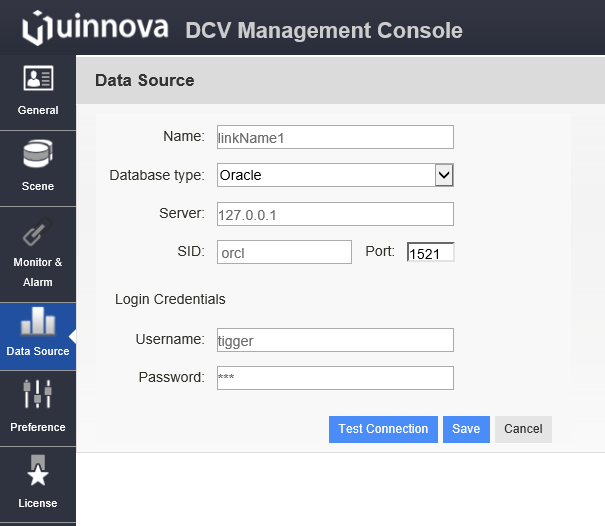

.. _api-jdbc-label:

JDBC API
--------------

uDCV can connect and fetch data from external database using JDBC, to setup database connection, configure field mapping and schedule data fetch job, please go to management ``console --> data source`` menu in left-hand side navigation bar.

**Define Datasource**

